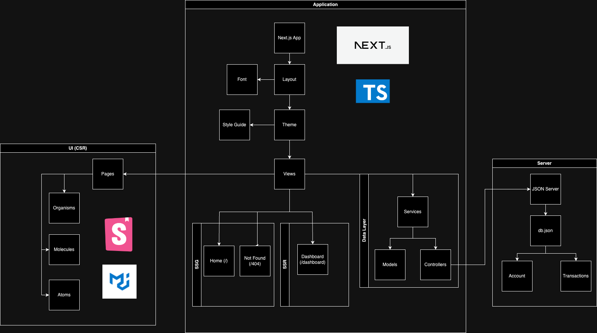
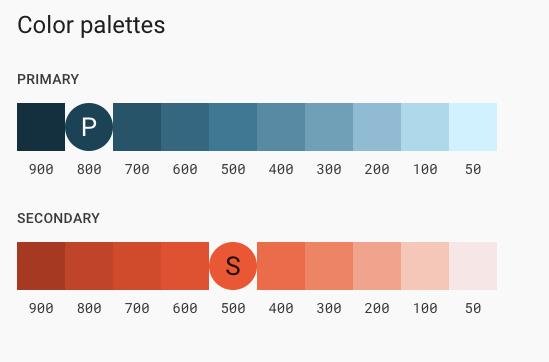

# FIAP Tech Challenge - Fase 4

Projeto desenvolvido em grupo para o quarto tech challenge da FIAP.

## Resumo

Trata-se de uma plataforma fictícia para a empresa financeira "Bytebank".
O protótipo das telas desenvolvidas pode ser encontrado no [Figma](https://www.figma.com/design/ns5TC3X5Xr8V7I3LYKg9KA/Projeto-Financeiro?node-id=503-4264&t=nhWQMyJ7ZmXNWbb6-1).

## Arquitetura do projeto

A arquitetura da quarta fase do projeto levou em consideração as decisões arquiteturais do resultado da primeira fase com as novas features implementadas na segunda fase, tendo em vista que decidimos usar o mesmo projeto e expandir a partir dele.

A arquitetura anterior era focada em uma aplicação Next com diferentes renderizações e separação clara entre UI e dados.

WIP - DESCREVER ARQUITETURA FASE 4

### Styleguide

Para o desenvolvimento do projeto nós seguimos o style guide proposto, porém com adaptações para seguir o [Material Design](https://m3.material.io/) e outras práticas que o grupo achou pertinente mudar.

### Demo

Video de demonstração do projeto no [Youtube]().

## Rodando o projeto

**Requisitos**

1. Tenha certeza que está usando a versão LTS do [Node.js (20.x)](https://nodejs.org/en)

   a. Recomendamos o uso do [nvm](https://github.com/nvm-sh/nvm)

   b. Caso esteja usando o nvm, antes de instalar as deps rode `nvm use` e se necessário `nvm install` e depois `nvm use` novamente.

Para instalar as deps quando já estiver utilizando a versão LTS do Node, rode `npm i` ou `npm install`.

### Ambiente de desenvolvimento local

1. Executar todas as aplicações: `npm run dev`

   a. Acompanhe a execução do Lerna nos diferentes projetos

   b. A api iniciará em [http://localhost:5000](http://localhost:5000)

   c. O app será executado em [http://localhost:3000](http://localhost:3000)

Para buildar o app basta executar `npm run build`.

2. Storybook e build da lib em watch mode: `npm run storybook`

   a. A documentação iniciará em [http://localhost:6006](http://localhost:6006) e a lib estará buildando em watch-mode (ou seja, voce pode fazer alterações e verificar nos projetos que consomem em tempo real, caso estejam rodando)

## Tecnologias utilizadas

- [Next.js](https://nextjs.org/): Meta-framework de [React.js](https://react.dev/) para construção de aplicações completas para produção;
- [Typescript](https://www.typescriptlang.org/): Runtime para JavaScript que possibilita a tipagem estática da linguagem;
- [Material UI](https://mui.com/): Framework de UI para construção de componentes com base nos guidelines do [Material design](https://m3.material.io/) e utilização de Style-In-JS com [Emotion](https://emotion.sh/docs/introduction).
- [Storybook](https://storybook.js.org/): Construção de documentação e biblioteca de componentes.

## Conceitos aplicados

- [Design System](https://www.figma.com/blog/design-systems-101-what-is-a-design-system/): Para construção de componentes reutilizáveis e padrões de tema, cores, espaçamentos e etc;
- [MVC](https://www.geeksforgeeks.org/mvc-design-pattern/): Para separação de responsabilidades dos services e utilização de programação orientada a objetos;
- [Atomic design](https://atomicdesign.bradfrost.com/chapter-2/): Para componentização separada em categorias, possibilitando mais reutilização e semântica;
- [Colocation](https://kentcdodds.com/blog/colocation): Para organização dos diretórios e maior facilidade de trabalho;

## Outras ferramentas úteis

- [Material Design Color Pallete](https://m2.material.io/inline-tools/color/): Para gerar a paleta de cores;
- [Adobe Color](https://color.adobe.com/create/color-contrast-analyzer): Para validar contraste;
